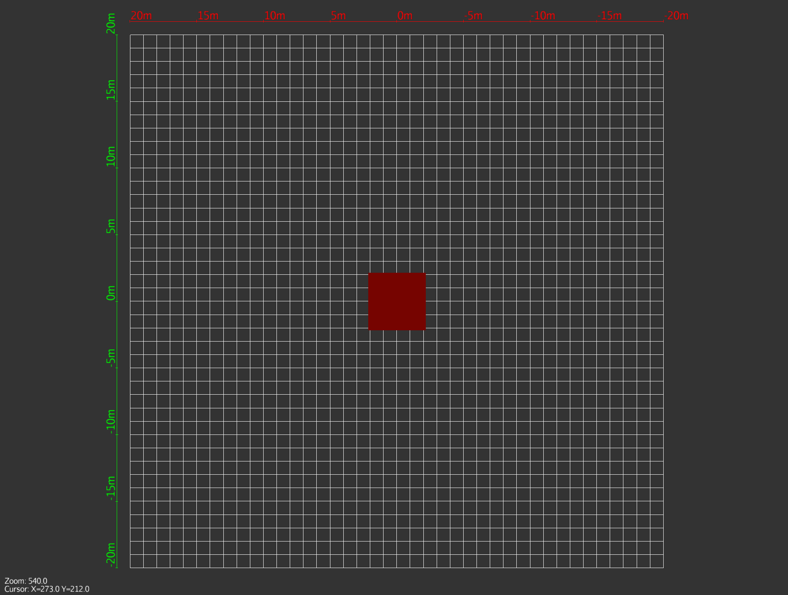
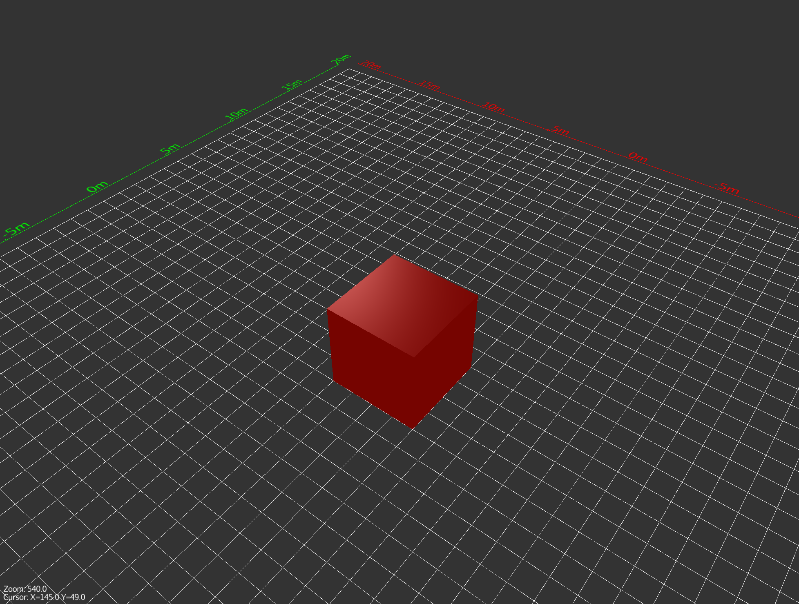
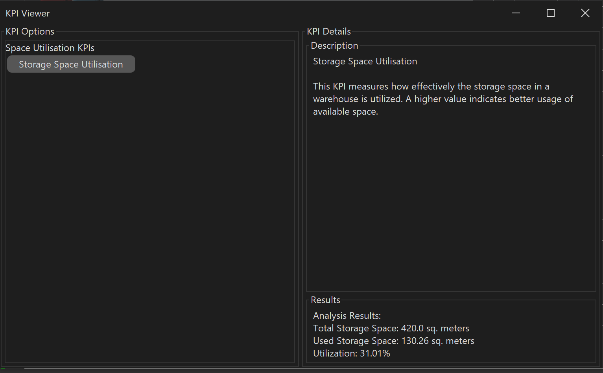
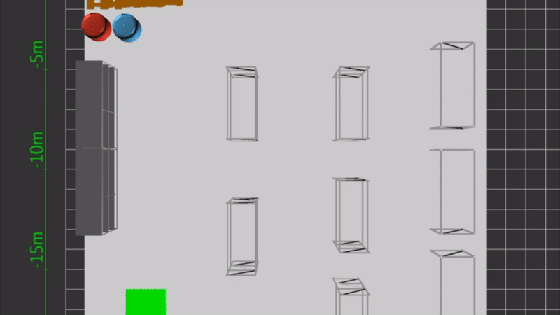
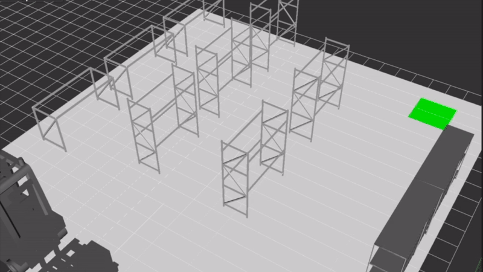
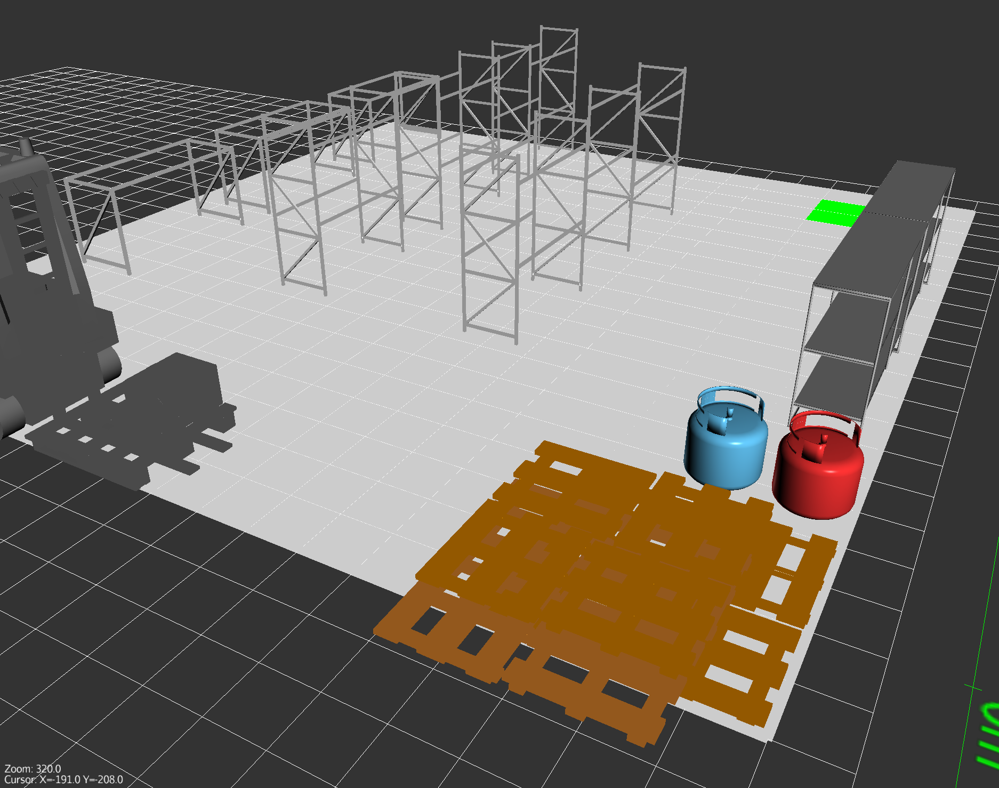
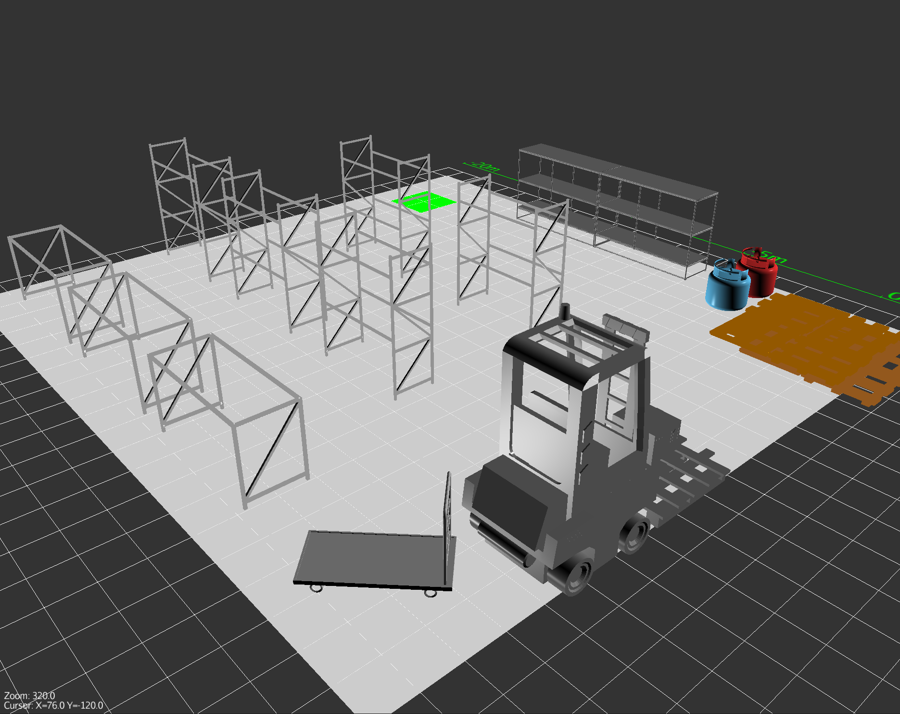
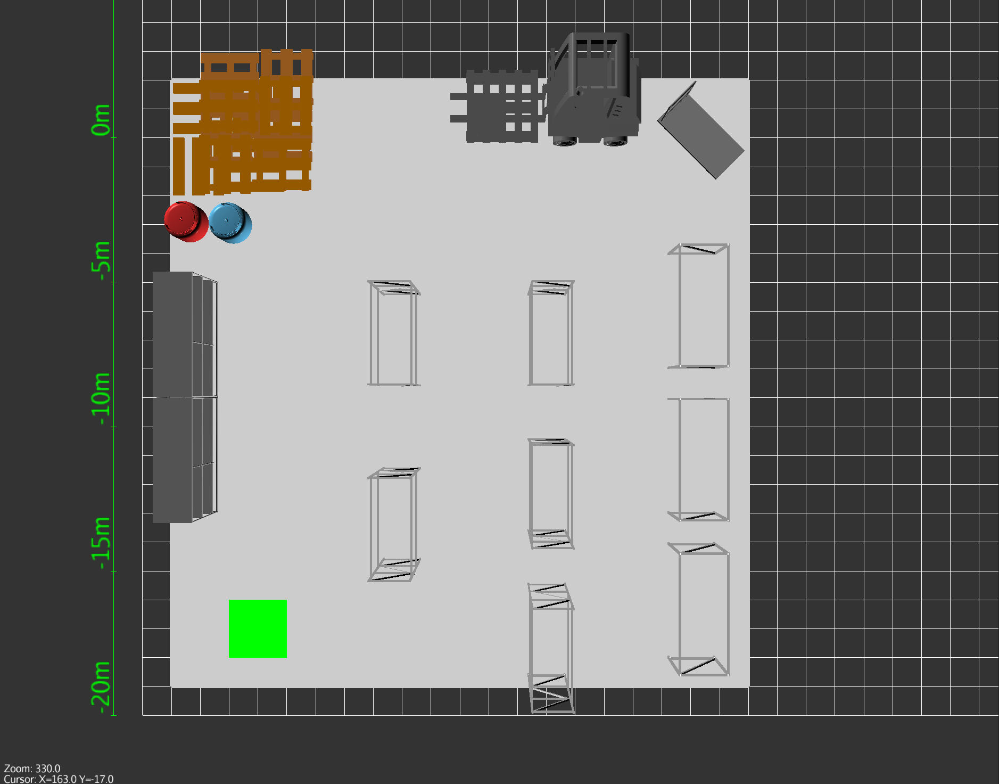

# WareSklad: Warehouse Planning, Analysis and Automation

**WareSklad** is a multiplatform desktop application designed for planning, modeling, analyzing, and automating warehouses in 2D/3D environments. Easy and intuitive navigation through the scene and the UI, bringing your warehouse vision to life with precision and flexibility.

---

## 🚀 Features at a Glance

- **Interactive 3D and 2D Views:** Effortlessly switch between 2D and 3D perspectives to design and explore your warehouse.  
   

- **Model Placement and Customization:** Create, drag, and configure warehouse elements directly in the scene.  
  

- **Free Scene Navigation:** Use intuitive controls to move freely within the scene, with mouse and keyboard.
  - **Place Models:** Take models from the library and drag them in the workspace.
  - **Navigate:** Use the toolbar for 2D/3D switching and scene controls.
  - **Save and Load Projects:** Save your layout to a file and reload anytime.

- **Warehouse KPIs/Analysis Tools:** Built-in utilities to evaluate your warehouse's layout for efficiency, safety, and automation readiness.  
  

- **Automation and Simulation Capabilities:** Automate and simulate processes like item transport, storage, and retrieval with a few clicks.  
   

---

## 🖥️ Getting Started

1. **Download and Install**
    - Download the latest release from the [Releases Page](#).
    - Run the installer and follow the on-screen instructions.

2. **Launch WareSklad**
    - Start the application and begin designing your warehouse.
    
---

## 🌟 Showcase

### Example Designed Warehouse Layout
   
  

---

## 🛠️ Technologies Used

- **Java**: Core programming language.
- **JMonkeyEngine (JME)**: 3D graphics engine.
- **Swing**: UI framework.

---

## 🌟 Future Updates

- More models, KPIs, simulations.
- Improved automation workflows.
- Cloud integrations.

---

## 🖋️ Author

- [GitHub](https://github.com/ugotgnomedha)
- [LinkedIn](https://www.linkedin.com/in/nikitaplotnikov)  
